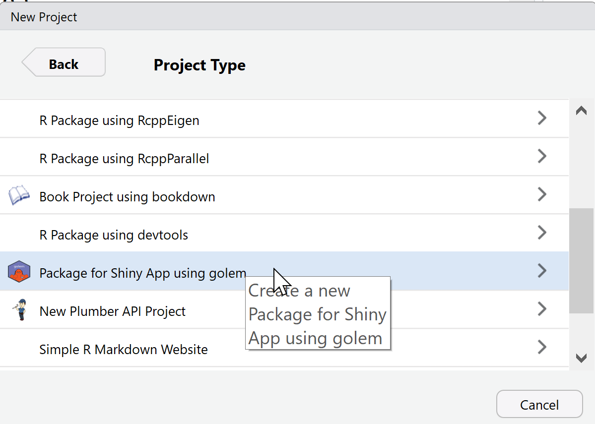

<!-- README.md is generated from README.Rmd. Please edit that file -->

[](https://www.tidyverse.org/lifecycle/#experimental)

**WORK IN PROGRESS**

# {golem}

{golem} is a package that provides tools for a better workflow for
working on shinyapps.

## Installation

You can install the development version from
[GitHub](https://github.com/Thinkr-open/golem) with:

``` r
# install.packages("remotes")
remotes::install_github("Thinkr-open/golem")
```

## Launch the project

Create a new package with the project template:



## Step by step guide

After project creation, you’ll land on `dev_history.R`. This file is
used to keep a track of all the steps you’ve followed to build your app.

You can follow it step by step of skip some if you’d like.

### Fill the description

`golem::fill_desc()` allows to fill the DESCRIPTION quickly.

``` r
golem::fill_desc(
  pkg_name = , # The Name of the package containing the App 
  pkg_title = , # The Title of the package containing the App 
  pkg_description = , # The Description of the package containing the App 
  author_first_name = , # Your First Name
  author_last_name = , # Your Last Name
  author_email = , # Your Email
  repo_url = NULL) # The (optional) URL of the GitHub Repo
```

### Set common Files

Call the {usethis} package to set a list of elements:

``` r
usethis::use_mit_license(name = "Your Name")
usethis::use_readme_rmd()
usethis::use_code_of_conduct()
usethis::use_lifecycle_badge("Experimental")
usethis::use_news_md()
```

If you have data in your app:

``` r
usethis::use_data_raw()
```

### Use Recommended Package

This adds a series of packages as dependecies to your app. See
`?golem::use_recommended_dep` for the list.

``` r
golem::use_recommended_dep()
```

### Add various tools

These three functions adds one file each which contain a series of
functions that can be useful for building your app. To be used in the
UI, in the server, or as prod-dependent tools.

``` r
golem::use_utils_ui()
golem::use_utils_server()
golem::use_utils_prod()
```

### Create modules

This function takes a name xxx and creates a module called `mod_xxx.R`
in the R folder.

``` r
golem::add_module(name = "this")
```

The new file will contain:

``` r
# mod_UI
thisui <- function(id){
  ns <- NS(id)
  tagList(
  
  )
}

this <- function(input, output, session){
  ns <- session$ns
}
    
# To be copied in the UI
thisui("thisui")
    
# To be copied in the server
callModule(this, "thisui")
 
```

### Add tests

Adds the recommended tests for a shiny app.

``` r
golem::use_recommended_tests()
```

### app\_prod

There’s a series of tools to make your app behave differently whether
it’s in dev or prod mode. Notably, the `app_prod()` and `app_dev()`
function tests for `options( "golem.app.prod")` (or return TRUE if this
option doesn’t exist).

Setting this options at the beginning of your dev process allows to make
your app behave in a specific way when you are in dev mode. For example,
printing message to the console with `cat_dev()`.

``` r
options( "golem.app.prod" = TRUE)
golem::cat_dev("hey\n")
options( "golem.app.prod" = FALSE)
golem::cat_dev("hey\n")
#> hey
```

You can then make any function being “dev-dependant” with the
`make_dev()` function:

``` r
log_dev <- golem::make_dev(log)
log_dev(10)
#> [1] 2.302585
options( "golem.app.prod" = TRUE)
log_dev(10)
```

### Deployment tools

This creates a simple file at the root of the package, to be used to
deploy to RStudio Connect.

``` r
golem::add_rconnect_file()
```

### Tool series

This package is designed to work well with :

  - {shinipsum} - <https://github.com/ThinkR-open/shinipsum>

### Know more

#### Building big Shiny Apps :

  - Part 1:
    <https://rtask.thinkr.fr/blog/building-big-shiny-apps-a-workflow-1/>

#### Blog post Read our blog post for more info about the content:

<https://rtask.thinkr.fr/blog/our-shiny-template-to-design-a-prod-ready-app/?noredirect=en_US>

## CoC

Please note that this project is released with a [Contributor Code of
Conduct](CODE_OF_CONDUCT.md). By participating in this project you agree
to abide by its terms.
